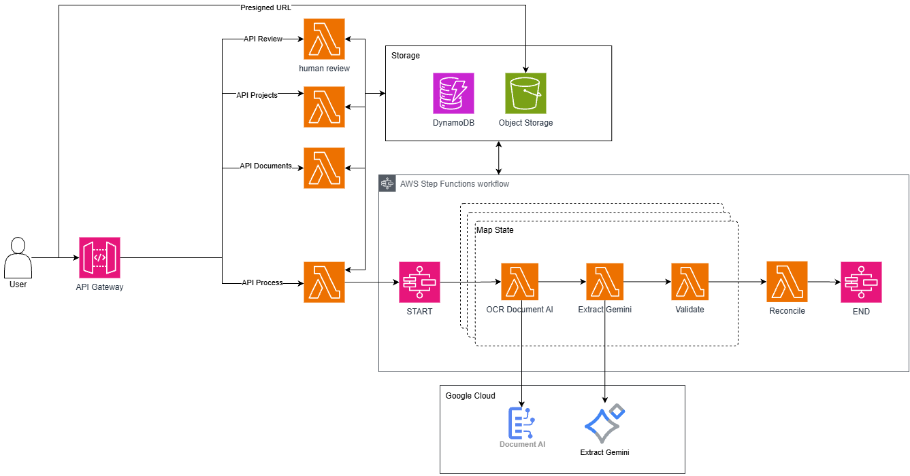

# AI Document Intelligence & Reconciliation Platform

Hệ thống AI **trích xuất – kiểm tra – đối soát** chứng từ doanh nghiệp **tiếng
Việt**: Purchase Order, hóa đơn, biên bản nghiệm thu.

Người dùng gom chứng từ vào một *project*, bấm xử lý; hệ thống OCR từng file
(Google Document AI), trích xuất thành JSON có cấu trúc (Gemini), kiểm tra bằng
rule nghiệp vụ **deterministic**, rồi đối chiếu chéo nhiều chứng từ để tìm mâu
thuẫn — lệch số tiền, lệch số lượng, sai ngày, thiếu tham chiếu. Kết quả **luôn**
đi qua Human Review trước khi được chốt.

Hạ tầng serverless trên **AWS** (API Gateway + Lambda + Step Functions +
DynamoDB + S3), AI chạy trên **Google Cloud** (Document AI + Gemini), IaC bằng
**Terraform**. Frontend React 19 + TypeScript + Vite + Tailwind v4.

Đo trên 6 chứng từ thật: OCR chính xác **97,6%**, dấu tiếng Việt **99,5%**, chi
phí **$0,021** — [evaluation/FINDINGS.md](evaluation/FINDINGS.md).

> **Trạng thái: POC.** Chưa có authentication — đây là giới hạn **cố ý** ở giai
> đoạn này, xem [docs/architecture.md](docs/architecture.md) §11. Đừng đưa dữ
> liệu thật chưa ẩn danh vào hệ thống.

---

## 1. Ba khái niệm cốt lõi

| Khái niệm | Vòng đời | Ghi chú |
|---|---|---|
| **Project** | Sống lâu dài | Chứa N chứng từ, được bồi thêm theo thời gian |
| **Processing Run** | Một lần chạy | OCR / Extract / Validate cho chứng từ **chưa xử lý** |
| **Reconciliation** | Một lần đối chiếu | Chạy trên **toàn bộ** chứng từ đã xử lý của project |

Hệ quả bắt buộc:

- Xử lý per-document là **idempotent** — chạy lại không tốn tiền AI thêm lần nữa.
- Đối chiếu là thao tác **project-level**, gọi lại thoải mái vì **không đụng AI**.

Nên thêm một biên bản nghiệm thu vào project đã xử lý sẽ **chỉ OCR file mới**,
các file cũ được bỏ qua, rồi đối chiếu lại trên toàn bộ. Đây là yêu cầu nghiệp
vụ, không phải tối ưu.

---

## 2. Kiến trúc



<sub>Vẽ bằng draw.io. File PNG nhúng sẵn XML nguồn — kéo thẳng vào
[app.diagrams.net](https://app.diagrams.net) là sửa tiếp được, không cần giữ file `.drawio` riêng.</sub>

- **`states:StartExecution` chỉ ở `api-process`** — quyền *tiêu tiền AI*, cô lập
  nó là lý do chính của việc chia bốn. Bảng IAM:
  [docs/iac-plan.md](docs/iac-plan.md) §3.
- **Bảng định tuyến nằm ở hai nơi** (Terraform + `handler.py`) nên
  [`tests/test_routes.py`](backend/tests/test_routes.py) đọc thẳng `main.tf` để
  khoá lại.
- **Step Functions không chạm DynamoDB/S3** — mũi tên tới Storage trên sơ đồ là
  của các Lambda worker bên trong. Chi tiết:
  [docs/architecture.md](docs/architecture.md) §4.1.

Ba chi tiết của luồng xử lý mà sơ đồ chưa nói hết: **Map tách 3 state** để Gemini
trả 429 chỉ retry Gemini, không chạy lại Document AI (tốn tiền thật); **`Catch`
nằm bên trong iterator** nên một file hỏng không giết cả run, nó rơi sang
`MarkDocumentFailed` còn các file khác chạy tiếp; và Step Functions **không chờ**
Human Review — execution kết thúc ở `AWAITING_REVIEW`, review là API riêng.
Lý do đầy đủ: [docs/architecture.md](docs/architecture.md) §4–§6.

---

## 3. Cấu trúc repo

```
backend/
  api/         handler.py (router 4 miền) + projects · documents · process · reconcile · review
  workers/     ocr · extract · validate · reconcile · mark_failed + steps.py
  core/        validate.py (luật TRONG 1 chứng từ) · rules.py + crosscheck.py
               (luật GIỮA nhiều chứng từ) — KHÔNG gọi AI
  common/      s3 · dynamodb · stepfunctions · ai_clients · audit · errors · ids
  schemas/     purchase_order · invoice · acceptance_record · unknown + registry.py
  devserver/   chạy backend ở localhost (moto giả lập AWS, AI THẬT)
  tests/       pytest, offline hoàn toàn
frontend/      React 19 + TS + Vite + Tailwind v4 — 2 màn hình
docs/ · evaluation/ · infra/    tài liệu · spike đo AI · Terraform
```

Thêm loại chứng từ mới = 1 file trong `schemas/` + đăng ký vào `registry.py` +
(nếu cần) vài rule trong `core/rules.py`. **Không** phải sửa prompt, Step
Functions, API hay data model — prompt được **sinh ra từ registry**.

---

## 4. Chạy ở máy

### 4.1 Yêu cầu

Python 3.11+ · Node 20+ · tài khoản Google Cloud (có $300 credit dùng thử).
Không cần tài khoản AWS — dev server giả lập AWS bằng `moto`.

### 4.2 Cài lần đầu

```powershell
git clone <repo> reconciliation-platform
cd reconciliation-platform

cd backend
python -m venv .venv
.venv\Scripts\python.exe -m pip install -r requirements-dev.txt

cd ..\frontend
npm install
```

Cài `requirements-dev.txt` chứ không phải `requirements.txt`: nó đã `-r` file
kia rồi thêm `pytest`, `pyflakes` và `moto[s3,dynamodb,server]` — dev server bắt
buộc phải có moto ở **chế độ server**, không dùng được bản in-process.

### 4.3 Credential

```powershell
cd evaluation
Copy-Item .env.example .env      # rồi điền GEMINI_API_KEY, DOCAI_PROJECT,
                                 # DOCAI_OCR_PROCESSOR_ID
```

Chú thích từng biến nằm ngay trong `.env.example`; lấy giá trị ở đâu thì xem
[evaluation/README.md](evaluation/README.md). `.env` đã gitignore.

### 4.4 Cảnh báo: dev server gọi AI THẬT và tốn tiền thật

> - **AWS thì giả, AI thì thật.** Chỉ hạ tầng AWS được `moto` giả lập; Document
>   AI và Gemini luôn gọi thật.
> - **Thiếu credential thì thoát ngay lúc khởi động** (exit 2).
> - Mặc định Enterprise Document OCR **$0,0015/trang** — 6 chứng từ mẫu (14
>   trang) ≈ **$0,021**, cộng ~$0,01 Gemini.
> - **Bấm Xử lý lần hai không tốn thêm**: `/process` bỏ qua chứng từ đã `VALIDATED`.
> - Nhưng `moto` giữ mọi thứ **trong RAM** — tắt là mất sạch, lần sau OCR lại từ
>   đầu và tốn tiền lại.

### 4.5 Chạy — hai terminal

```powershell
# Terminal 1 — backend
cd backend
.venv\Scripts\python.exe -m devserver --upload ..\evaluation\dataset\documents

# Terminal 2 — frontend
cd frontend
npm run dev
```

| | |
|---|---|
| Giao diện | http://localhost:5173 |
| API | http://127.0.0.1:8000 |
| AWS giả lập | http://127.0.0.1:5000 (moto) |

Cờ `--upload` tạo sẵn project và upload sẵn file trong thư mục — **$0, vì upload
không gọi AI**. Lưu ý `evaluation/dataset/documents/` **đã gitignore** nên rỗng
khi mới clone: bỏ cờ này đi, hoặc tự bỏ file `.pdf` / `.png` / `.jpg` vào đó.

Mô tả 4 tab của giao diện và cơ chế polling:
[frontend/README.md](frontend/README.md).

---

## 5. Test và lint

```powershell
cd backend; .venv\Scripts\python.exe -m pytest -q
cd backend; .venv\Scripts\python.exe -m pyflakes api common core schemas workers tests devserver
cd frontend; npm run typecheck
```

**Phải chạy từ trong `backend/`** (import phụ thuộc CWD). Test **offline hoàn
toàn** — không cần AWS thật (`moto`) lẫn Google credential (`ai_clients.py`
import lazy trong hàm). Kiểm thử Step Functions không cần deploy, không cần
Docker: [infra/statemachine-test/README.md](infra/statemachine-test/README.md).

---

## 6. Deploy lên AWS

```powershell
infra\scripts\build_backend.ps1          # -> infra/artifacts/backend.zip

cd infra
.\bin\terraform.exe init
.\bin\terraform.exe plan  -var-file=dev.tfvars
.\bin\terraform.exe apply -var-file=dev.tfvars
```

Tạo ra **10 Lambda** (4 `api` + 6 worker). Điều kiện cần trước đó: binary
terraform tải sẵn vào `infra/bin/` · `aws configure` region `ap-southeast-1` ·
`dev.tfvars` điền từ `dev.tfvars.example`.

**Hướng dẫn đầy đủ: [infra/README.md](infra/README.md)** — lấy credential, tạo
processor, kiểm tra sau apply, xoá hạ tầng.

---

## 7. Tài liệu chi tiết

| Tài liệu | Nội dung |
|---|---|
| [docs/architecture.md](docs/architecture.md) | Kiến trúc, lý do chọn Step Functions và polling |
| [docs/data-model.md](docs/data-model.md) | 5 bảng DynamoDB, GSI, layout S3 |
| [docs/schemas.md](docs/schemas.md) | Schema từng loại chứng từ + danh sách rule đối chiếu |
| [docs/iac-plan.md](docs/iac-plan.md) | Toàn bộ tài nguyên AWS và API surface |
| [backend/devserver/README.md](backend/devserver/README.md) | Dev server, chi phí từng processor, dev/cloud tách nhau thế nào |
| [frontend/README.md](frontend/README.md) | 2 màn hình, presigned POST, polling tiến độ |
| [evaluation/README.md](evaluation/README.md) | Spike đo chất lượng AI, nguồn dataset tiếng Việt |
| [evaluation/FINDINGS.md](evaluation/FINDINGS.md) | Kết quả đo trên chứng từ thật |
| [infra/README.md](infra/README.md) | Deploy Terraform từ đầu đến cuối |
| [infra/statemachine-test/README.md](infra/statemachine-test/README.md) | Kiểm thử ASL, không cần Docker |

---

## 8. Chưa làm

Authentication (Cognito) · WebSocket cho progress (hiện dùng polling, nâng cấp
sau bằng DynamoDB Streams mà không phải sửa worker) · remote tfstate ·
dataset 50–100 tài liệu kèm ground truth · deploy frontend lên S3/CloudFront ·
dark mode · phân trang · xoá project.
